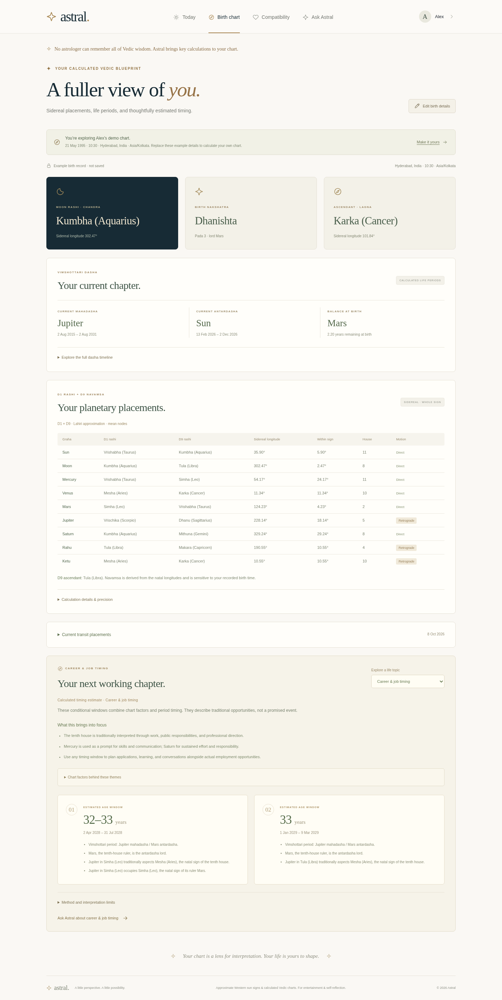

# Astral

A Vedic birth-chart and astrology chat app built with React, TypeScript, Vite, and Node/Express. The server calculates chart facts; a local guide or an optional language model explains them.

[Deploy to Render](https://render.com/deploy?repo=https://github.com/iamsreecharan/Astrology_AI) · [Deployment guide](docs/DEPLOY.md) · [Calculation methods](docs/VEDIC.md)



The visual theme combines an indigo planetarium with ivory reading panels, copper and jade accents, and orbital linework across desktop and mobile. The screenshot uses an example profile. New tab sessions open with [“Welcome to a world moved by the cosmos.”](docs/welcome.png), with visibly revolving and rotating planets. Desktop planets move along tilted orbits with perspective depth. **Pause planets** stops the welcome animation; **Animate planets** starts it, including when your system prefers reduced motion. The background honors the system preference again after entry. Choose Enter Astral, Skip intro, or Escape to continue immediately. AI Yogi then holds a small invitation to personalize your astrology: choose **Personalize my astrology** to enter your recorded birth details, or **Skip for now** to explore. Both the intro and a dismissed invitation stay out of the way on reload in that tab. Visitors with a complete saved birth profile go straight into the app after the intro. Render creates a live URL after deployment; the cloud-onboarding screen does not provide an app preview.

## What it does

- Calculates approximate Lahiri sidereal D1 and D9/Navamsa placements, whole-sign houses, Moon rashi, nakshatra and pada, ascendant, mean Rahu/Ketu, and planetary motion.
- Shows Vimshottari birth balance, mahadasha/antardasha timelines, and current transits.
- Estimates traditional marriage windows with dates, completed-age ranges, and calculation reasons. It returns no window when the rules find none.
- Labels calculated marriage and career periods **Most supported**, **Joint most supported**, or **Supported**, with the same guidance in chat, AI Yogi and the English PDF.
- Finds conditional career opportunity periods and tracks changes in Saturn's traditional Moon-relative phases.
- Explains married life, education, finances, family, travel, wellbeing, and general life themes using the relevant houses, rulers, and dasha periods.
- Opens chat in **Vedic AI** when a server key is configured, with **Local** beside it for the calculated guide.
- Suggests birthplaces worldwide as you type, with coordinates and time zones filled from the selected place.
- Gives short, question-first chat replies, with supporting calculations available in **Calculation details**.
- Adds **AI Yogi**, an animated 3D guide with multilingual text and natural speech. Start a conversation once and it listens again after each answer until you end or close it.
- Downloads an English horoscope PDF with your birth record, Panchanga basics, D1 and D9 chart diagrams, planetary positions, Vimshottari periods, transits, and all ten life-topic assessments.
- Shows nearer career periods first, with six-month application/interview planning windows and individual star-based dates in DD-MM-YYYY.
- Tells the story behind Indian sky-watching, timekeeping, and chart interpretation in **About**, with historical references and calculation notes.
- Opens with a moving 3D planetary welcome and a skippable profile invitation held by AI Yogi, then keeps animated Saturn, Earth, Jupiter, Mars, the Moon, and twinkling stars behind the app. Reduced-motion preferences get a static scene; WebGL has an animated SVG fallback.
- Keeps Western calendar sun-sign daily reflections and compatibility available for date-only profiles.
- Compares two recorded birth profiles through the eight Ashta Koota categories, with a score out of 36, traditional benchmark bands and a downloadable English Kundali matching report.
- Saves profiles in the current browser, with controls to edit or remove them.

These are traditional chart interpretations and limited timing rules, not validated forecasts. A window does not promise a marriage, job, financial result, or an end to hardship. The [method notes](docs/VEDIC.md) explain each method.

Support labels compare the shown timing windows using the existing dasha and transit rules. They are not measured percentage chances, and a single qualifying window is labeled **Supported** without claiming it is the strongest. Other readings identify traditional themes or calculated Saturn phases; career preparation dates remain planning suggestions.

## Run it

Use Node 24.5 or later within Node 24; `.nvmrc` pins the tested version.

```sh
npm ci
npm run dev
```

The app and API share port 3000, with hot reload in development. Set `PORT` or `HOST` to change the listening address.

For production:

```sh
npm run build
npm start
```

Build the assets before starting. The build prepares Brotli and gzip copies of text assets; the server negotiates compression and caches files with content hashes. HTML revalidates so a new release can load its current assets. The [Render Blueprint](docs/DEPLOY.md) runs this workflow without a separate database or calculation service. Place search reads the bundled SQLite file through Node 24's built-in SQLite support; Python and an external geocoding service are not needed at runtime.

## Add a birth profile

In the profile editor, enable **Add birth time and place for a Vedic chart**. Enter the date and recorded local birth time, then start typing the birthplace and select a suggestion. The selection fills its latitude, longitude, and IANA time zone, such as `Asia/Kolkata`. Check the country and region when places share a name. The server applies historical time-zone rules.

The bundled GeoNames snapshot covers 234,908 places across 246 country codes and 394 time zones, including cities, towns, and many smaller settlements. It does not cover every village, address, or hospital. If the place is missing or the coordinates need adjustment, use **Enter location manually**. Editing a selected place clears its coordinates so an old location is not used for a new name. See the [data source and license](server/data/README.md) for the snapshot and CC BY 4.0 attribution.

Birth dates are supported from 1900 through today, and transits through 2100. Partial details and ambiguous or nonexistent daylight-saving times return an error instead of a guessed chart. If your recorded time is unknown, keep a basic profile for daily reflections and Western compatibility.

Open **Birth chart** for placements, periods, and the topic selector. In **Ask Astral**, try “When might I get married?”, “When could I find a job?”, “How does my chart describe married life?”, or “When does my current Saturn phase change?” Chat answers the exact question in everyday language first, then gives a brief calculated reason. English questions receive English answers even after a conversation in another language. If a generated answer clearly uses a different language, the server tries once to correct it with the same calculated facts; a second mismatch returns a visible error. Expand **Calculation details** to inspect the chart factors, periods, and references. Results from the labeled example profile are demonstrations.

## Download your horoscope

Save your recorded birth date, time and place, then open **Birth chart → Download English PDF**. The report follows a traditional birth-record layout in English, with South Indian fixed-sign D1 and D9 diagrams, birth star and pada, rashi and lagna, all planetary positions, birth dasha balance, the full computed mahadasha/antardasha sequence, and current transits. Marriage, career, married life, challenging periods, education, finances, family, travel, wellbeing, and life direction each include their calculated factors and dates where available.

Birth Panchanga basics include civil weekday, tithi and paksha, yoga, karana, and sunrise/sunset at the selected place. They use the app's approximate astronomical model. The report distinguishes civil weekday from traditional sunrise-based vara; lunar calendar years, months, and exact tithi/yoga ending times are not supplied. Polar days without a sunrise or sunset are identified rather than assigned a clock time.

The career section also lists individual dates to consider for applications and interviews, in **DD-MM-YYYY**, with nakshatra, Tarabala, Chandrabala, tithi and reasons. These use a noon sample in your saved birth time zone; check your current location before scheduling. They are limited traditional planning suggestions, rather than exact appointment times or promised job dates. Nearer periods come first, and a stronger later career period is not a reason to delay applying now.

PDF generation works without an AI key and recalculates the chart on the server. The report contains your entered birth details and stays in your own downloads; the app does not save a copy or send it to a language model. A date-only or demonstration profile cannot download a personal report. Bundled licensed fonts keep English text searchable and support common Indian and world scripts in entered names. Calculation methods and warnings are included, and timing windows remain conditional traditional estimates.

## Match two Kundalis

Open **Compatibility → Kundali matching** and enter each person's name, recorded birth date and time, and birthplace. Select a place suggestion to fill its coordinates and historical time zone, or enter those manually. Birthplace is needed to interpret the local birth time correctly. Names identify the records; the score comes from calculated sidereal Moon signs and birth stars.

The result breaks down **Varna (1), Vashya (2), Tara (3), Yoni (4), Graha Maitri (5), Gana (6), Bhakoot (7), and Nadi (8)**. It shows the points awarded, a short calculation explanation, and how many categories received full, partial or zero points. **Download matching PDF** includes both birth records, the eight-category table, the benchmark and the reasons behind each score. Calculations and downloads need no AI key and do not send the records to a model or store a server-side report.

The displayed bands are below 18, 18 to under 25, 25 to under 33, and 33–36. They correspond to below the common minimum, acceptable, good and excellent **traditional scores**. The common 18-point benchmark and the detailed rules vary between astrologers. This is a named North Indian Ashta Koota method, rather than every form of Jathakam matching; its Nadi and Bhakoot categories do not establish health, fertility or relationship success. Both partners' consent, communication and circumstances matter. Western sun-sign reflections remain available beside Kundali matching.

## Enable Vedic AI

The calculated local guide works without credentials and does not use a language model. Live chat uses an existing OpenAI model grounded in the computed chart and selected original Jyotish notes. It is not custom-trained on all Vedic astrology.

Set `ASTROLOGY_AI_API_KEY` securely for the server you are using:

- **Render:** add it in the service's **Environment** settings, then save and redeploy/restart.
- **Codex cloud:** bind it in the environment's secret settings, save the configuration, and restart the app in an environment that has that binding.
- **Local development:** add it to an ignored `.env` file in the repository, then restart `npm run dev`.

These settings are separate. A key added locally or in Codex cloud does not automatically reach Render. `ASTROLOGY_AI_MODEL` is optional and defaults to `gpt-4.1-mini`. A valid key, model access, and provider billing are required; no key is included. After restarting, check the connection again in **Ask Astral**. Vedic AI is selected by default when this server reports a configured key, and Local is the second option. Choosing Local keeps that choice during connection checks and tab changes. Key presence alone does not verify provider access.

Live chart chat in **Ask Astral** requires a complete birth profile. **AI Yogi** can answer general questions without one; personal chart readings and timing need your saved birth details. The labeled example profile is not used as your personal Yogi chart. The server sends derived chart facts, selected notes, the question, and up to six recent conversation messages to OpenAI. It excludes the raw profile name, birth date/time, place, coordinates, and time zone from the structured model context. Personal information typed into messages can still be sent. The model explains supplied values rather than calculating planetary positions; topic assessments and timing windows come from the server's rules.

The key stays on the server. Node's `--use-env-proxy` supports the cloud platform's HTTPS proxy route; the cloud secret destination is `api.openai.com`. Keep keys out of browser code, Git, and chat. Provider errors stay visible, and Local mode remains available.

## Talk with AI Yogi

Open **AI Yogi** and choose **Start conversation**. This enables sound for the session. Allow microphone access, speak, and pause briefly when you finish. The guide transcribes your question, shows its answer, automatically speaks those same words, and listens for your next question. The microphone is off while it thinks and speaks. **Send now** submits the current recording; **Stop voice** moves on to listening. **End conversation**, Close, Escape, or hiding the page stops the microphone and playback. Returning to the page requires an explicit resume.

**Auto** starts in English and matches another language when your current question clearly uses it, including recognized speech. It checks every turn independently, so you can move from English to Telugu and back to English in one conversation. Each answer keeps its own language for automatic speech and replay. Changing the picker cancels an older pending reply or recording and resumes an active conversation in the new selection. Short or unclear greetings and Vedic names alone use English. Choosing a language explicitly takes precedence over detection; the picker provides Indian and other world languages. You can always type, edit a transcription that exceeds the question limit, or replay an answer. Voice quality and transcription accuracy vary by language, pronunciation, and background noise. The animated guide is fictional and its voice is AI-generated.

Voice uses the same server key as chat. Defaults are `gpt-4o-mini-transcribe` for recognition and `gpt-4o-mini-tts` with the male `onyx` voice for speech. `ASTROLOGY_AI_TRANSCRIBE_MODEL` and `ASTROLOGY_AI_TTS_MODEL` are optional server overrides. Provider access and billing must cover these models as well as chat. Familiar, complete English questions select their calculated topic directly and need only the answer request. Other personal-chart questions first use the model classifier, including follow-ups, mixed topics and other languages. General turns without a profile also need only the answer request. Per-turn language checks and the bounded correction attempt still apply.

Microphone input needs HTTPS on a hosted site and a browser with MediaRecorder and Web Audio support. Recordings stop after 45 seconds or at 8 MiB. Quiet recordings are discarded without a provider request. Audio goes through this server to OpenAI for transcription; answer text goes to OpenAI for speech. The app does not save audio on the server. If permission, recognition, or playback fails, the written conversation remains available. Without a key, Yogi offers limited local English notes and text input.

## Checks

```sh
npm run check
```

This runs TypeScript checking, the production build, and Node tests for profiles, birthplace search, Western reflections, chart positions, D9, Vimshottari, topic assessments, timing rules, knowledge selection, and the API. Chart tests use independent numeric reference fixtures. Timing tests check period boundaries, ages, transit integration, ranking, and no-window behavior; they do not validate real-life outcomes.

Provider tests use controlled responses to check grounding, multilingual conversation handling, privacy filtering, audio validation, bounded responses, and failures without API charges. A real key must be verified separately. Browser checks also cover continuous turns, microphone cleanup, mobile layout, and natural audio playback.

See [performance notes](docs/PERFORMANCE.md) for measured calculation and transfer improvements, on-demand chart loading, and the remaining sources of hosted latency.

## API

| Endpoint | Purpose |
| --- | --- |
| `GET /api/health` | Service readiness |
| `GET /api/config` | Signs and AI availability; no credentials |
| `GET /api/places?q=...` | Worldwide birthplace suggestions and GeoNames attribution |
| `POST /api/profile` | Validate a profile |
| `POST /api/chart` | Calculate a chart from `{ profile }` |
| `POST /api/prediction` | Calculate a topic assessment from `{ profile, topic }` |
| `POST /api/report` | Download a calculated English PDF from `{ profile }`; complete birth details required |
| `POST /api/chat` | Answer `{ profile, message, focus, mode, history, assistant, language }` |
| `POST /api/transcribe?language=auto` | Transcribe a raw audio body, up to 8 MiB |
| `POST /api/voice` | Speak `{ text, language }` as MP3, up to 2,000 characters per request |
| `POST /api/reading` | Create a local daily reflection |
| `POST /api/compatibility` | Reflect on two Western sun signs |
| `POST /api/kundali-match` | Calculate Ashta Koota scores from `{ male, female }`, each a complete birth profile |
| `POST /api/kundali-report` | Download the calculated English matching PDF from the same two profiles |

A full profile looks like this:

```json
{
  "name": "Alex",
  "birthDate": "1995-05-21",
  "birthTime": "10:30",
  "birthPlace": "Hyderabad, India",
  "latitude": 17.385,
  "longitude": 78.4867,
  "timeZone": "Asia/Kolkata"
}
```

Prediction `topic` accepts `marriage`, `career`, `difficult-periods`, `married-life`, `general`, `education`, `finances`, `family`, `travel`, or `wellbeing`. The returned shape depends on the topic: event-related windows, Saturn phase changes, or house and dasha themes.

Chat `focus` accepts `general`, `love`, `career`, or `wellbeing`; `mode` accepts `local` or `ai`. Optional `history` contains up to six `{ role: "user" | "assistant", content: "..." }` messages. The server uses the question and recent context to select a topic, recalculates charts, and ignores client-supplied chart data.

`assistant` defaults to `astral`; `yogi` allows `profile: null` for general questions. `language` defaults to `auto` or accepts a BCP 47 tag such as `hi-IN` or `te-IN`. Transcription accepts WebM, MP4/M4A, WAV, OGG, and MP3 with their audio MIME types. Speech and transcription responses are not cached.

## Cloud setup

Use the existing `/workspace/Astrology_AI` checkout. Cloud tasks are already isolated; another Git worktree is unnecessary.

```sh
cd /workspace/Astrology_AI
npm ci --cache /workspace/.cache/npm --no-audit --no-fund
npm run check
npm run dev
```

This workspace needs the writable npm cache. Install and startup instructions are saved in the environment draft. Review and save them in settings, then publish to retain the prepared filesystem. Future tasks must start the process again. Saving configuration does not start a service or publish the environment, and cloud secrets do not transfer automatically to Render.

## Privacy and hosting

The application server does not persist profiles, conversations, audio, or generated reports. Saved profiles stay in browser local storage until removed or cleared. Chat stays in page state and disappears on reload. Birth inputs reach the server for calculation; AI mode also sends derived context and conversation to OpenAI. PDF reports are generated in memory and contain the personal birth record you choose to download.

The hosted service has no account authentication or per-user AI quotas. POST requests have an in-memory limit of sixty per minute per connection IP; a hosting proxy may make visitors share that budget. Add suitable access and usage controls before enabling a paid key for a wider audience.

## Code layout

- `src/`: interface and styles.
- `server/astrology.mjs`: profiles, Western signs, and daily reflections.
- `server/vedic-chart.mjs`: sidereal charts, D9, periods, and transits.
- `server/vedic-timing.mjs`: marriage-window rules.
- `server/prediction-support.mjs`: relative timing support and distinct interpretation, phase and planning labels.
- `server/kundali-matching.mjs`: the eight-category, 36-point matching method.
- `server/kundali-report.mjs`: the calculated English compatibility PDF.
- `server/vedic-forecast.mjs`: career windows and Saturn phase changes.
- `server/vedic-life.mjs`: house-based life topics and dasha themes.
- `server/vedic-knowledge.mjs`: original notes and grounded chat context.
- `server/places.mjs`: bounded, read-only birthplace search.
- `server/data/`: the bundled GeoNames SQLite snapshot and provenance.
- `server/app.mjs`: API, provider integration, and frontend serving.
- `server/voice.mjs`: audio transcription, natural speech, and language validation.
- `tests/`: calculation and HTTP tests.
